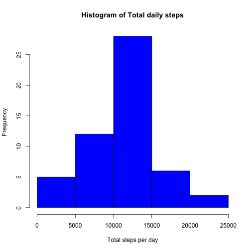
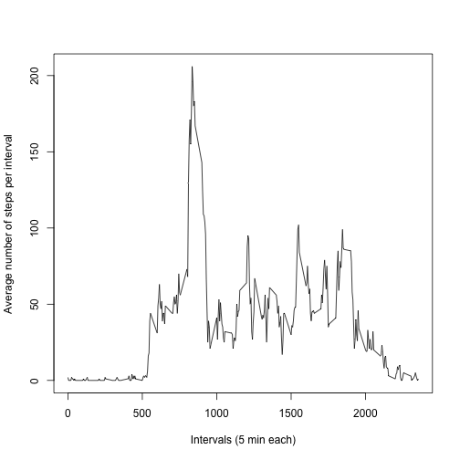
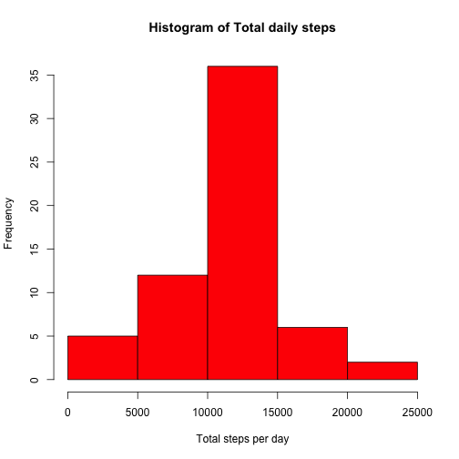
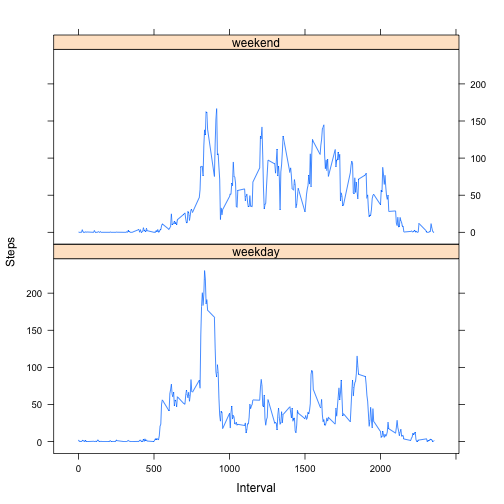

### Load packages


```r
library(plyr)
library(dplyr)
library(lubridate)
library(lattice)
```

### Loading and preprocessing the data

**1. Load the data.**


```r
rawActivityData <- read.csv("activity.csv")
```


**2. Process/transform the data (if necessary) into a format suitable for your analysis**


```r
activityNoNA <- rawActivityData[!is.na(rawActivityData),]
```

### What is mean total number of steps taken per day?

**1. Calculate the total number of steps taken per day**


```r
stepsTotalByDay <- activityNoNA %>% group_by(date) %>% summarise(total=sum(steps))
stepsTotalByDay <- stepsTotalByDay[!is.na(stepsTotalByDay$total),]
knitr::kable(stepsTotalByDay, align=c('l', 'l'), col.names=c("Date", "Total Steps"))
```


|Date       |Total Steps |
|:----------|:-----------|
|2012-10-02 |126         |
|2012-10-03 |11352       |
|2012-10-04 |12116       |
|2012-10-05 |13294       |
|2012-10-06 |15420       |
|2012-10-07 |11015       |
|2012-10-09 |12811       |
|2012-10-10 |9900        |
|2012-10-11 |10304       |
|2012-10-12 |17382       |
|2012-10-13 |12426       |
|2012-10-14 |15098       |
|2012-10-15 |10139       |
|2012-10-16 |15084       |
|2012-10-17 |13452       |
|2012-10-18 |10056       |
|2012-10-19 |11829       |
|2012-10-20 |10395       |
|2012-10-21 |8821        |
|2012-10-22 |13460       |
|2012-10-23 |8918        |
|2012-10-24 |8355        |
|2012-10-25 |2492        |
|2012-10-26 |6778        |
|2012-10-27 |10119       |
|2012-10-28 |11458       |
|2012-10-29 |5018        |
|2012-10-30 |9819        |
|2012-10-31 |15414       |
|2012-11-02 |10600       |
|2012-11-03 |10571       |
|2012-11-05 |10439       |
|2012-11-06 |8334        |
|2012-11-07 |12883       |
|2012-11-08 |3219        |
|2012-11-11 |12608       |
|2012-11-12 |10765       |
|2012-11-13 |7336        |
|2012-11-15 |41          |
|2012-11-16 |5441        |
|2012-11-17 |14339       |
|2012-11-18 |15110       |
|2012-11-19 |8841        |
|2012-11-20 |4472        |
|2012-11-21 |12787       |
|2012-11-22 |20427       |
|2012-11-23 |21194       |
|2012-11-24 |14478       |
|2012-11-25 |11834       |
|2012-11-26 |11162       |
|2012-11-27 |13646       |
|2012-11-28 |10183       |
|2012-11-29 |7047        |

**2. Make a histogram of the total number of steps taken each day**


```r
hist(stepsTotalByDay$total, col="blue", main="Histogram of Total daily steps", xlab="Total steps per day")
```

 

**3. Calculate and report the mean and median of the total number of steps taken per day.**


```r
mean(stepsTotalByDay$total)
```

```
## [1] 10766.19
```

```r
median(stepsTotalByDay$total)
```

```
## [1] 10765
```

### What is the average daily activity pattern?

**1. Make a time series plot of the 5-minute interval (x-axis) and the average number of steps taken, averaged across all days (y-axis)**


```r
stepsAvgByInterval <- activityNoNA %>% group_by(interval) %>% summarise(average=round(mean(steps)))
stepsAvgByInterval <- stepsAvgByInterval[!is.na(stepsAvgByInterval$interval),]
plot(stepsAvgByInterval, type="l", xlab="Intervals (5 min each)", ylab="Average number of steps per interval")
```

 

**2. Which 5-minute interval, on average across all the days in the dataset, contains the maximum number of steps? **


```r
stepsAvgByInterval[which(stepsAvgByInterval$average==max(stepsAvgByInterval$average)),1]
```

```
## Source: local data frame [1 x 1]
## 
##   interval
## 1      835
```

### Imputing missing values

**1. Calculate and report the total number of missing values in the dataset (i.e. the total number of rows with NAs)**


```r
nrow(rawActivityData[is.na(rawActivityData),])
```

```
## [1] 2304
```

**2. Devise a strategy for filling in all of the missing values in the dataset. **

**Strategy used: Using mean of steps by interval as value for imputing NAs in the original dataset**


```r
  activityDataImputed <- rawActivityData
  for (i in 1:nrow(activityDataImputed)) { 
      if( is.na(activityDataImputed$steps[i] )) { 
        activityDataImputed[i, "stepsImputed"] <- 
          round(stepsAvgByInterval[match(activityDataImputed$interval[i], stepsAvgByInterval$interval),2])
      } else {
         activityDataImputed[i, "stepsImputed"] <- activityDataImputed$steps[i]  
      }
  }
```

**3. Create a new dataset that is equal to the original dataset but with the missing data filled in.**


```r
nrow(activityDataImputed[is.na(activityDataImputed$stepsImputed),])
```

```
## [1] 0
```

```r
str(activityDataImputed)
```

```
## 'data.frame':	17568 obs. of  4 variables:
##  $ steps       : int  NA NA NA NA NA NA NA NA NA NA ...
##  $ date        : Factor w/ 61 levels "2012-10-01","2012-10-02",..: 1 1 1 1 1 1 1 1 1 1 ...
##  $ interval    : int  0 5 10 15 20 25 30 35 40 45 ...
##  $ stepsImputed: num  2 0 0 0 0 2 1 1 0 1 ...
```

**4. Make a histogram of the total number of steps taken each day.**


```r
stepsTotalByDayImputed <- activityDataImputed %>% group_by(date) %>% summarise(total=sum(stepsImputed))
stepsTotalByDayImputed <- stepsTotalByDayImputed[!is.na(stepsTotalByDayImputed$total),]
hist(stepsTotalByDayImputed$total, col="red", main="Histogram of Total daily steps", xlab="Total steps per day")
```

 

**4. Calculate and report the mean and median total number of steps taken per day.**


```r
mean(stepsTotalByDayImputed$total)
```

```
## [1] 10765.64
```

```r
median(stepsTotalByDayImputed$total)
```

```
## [1] 10762
```

### Are there differences in activity patterns between weekdays and weekends?

**1. Create a new factor variable in the dataset with two levels – “weekday” and “weekend” indicating whether a given date is a weekday or weekend day.**


```r
    for (i in 1:nrow(activityDataImputed)) { 
       wday <- wday(activityDataImputed$date[i], label=FALSE)
       if (wday > 1 && wday < 7) {
         activityDataImputed$weekday[i] <- "weekday"
       } else {
         activityDataImputed$weekday[i] <- "weekend"
       }
    }
    activityDataImputed$weekday <- factor(activityDataImputed$weekday)
    str(activityDataImputed)
```

```
## 'data.frame':	17568 obs. of  5 variables:
##  $ steps       : int  NA NA NA NA NA NA NA NA NA NA ...
##  $ date        : Factor w/ 61 levels "2012-10-01","2012-10-02",..: 1 1 1 1 1 1 1 1 1 1 ...
##  $ interval    : int  0 5 10 15 20 25 30 35 40 45 ...
##  $ stepsImputed: num  2 0 0 0 0 2 1 1 0 1 ...
##  $ weekday     : Factor w/ 2 levels "weekday","weekend": 1 1 1 1 1 1 1 1 1 1 ...
```

**2. Make a panel plot containing a time series plot (i.e. type = "l") of the 5-minute interval (x-axis) and the average number of steps taken, averaged across all weekday days or weekend days (y-axis). **


```r
avgStepsByWeekdayIntervalImputed <- activityDataImputed %>% group_by(weekday, interval) %>% summarise(average=mean(stepsImputed))
xyplot(average ~ interval | weekday, data = avgStepsByWeekdayIntervalImputed, xlab="Interval", ylab="Steps", type="l", layout=c(1,2))
```

 

